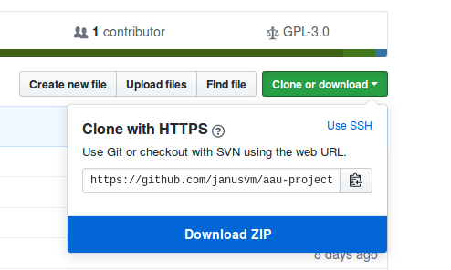

# AAU Project Template 

This repository contains LaTeX templates and various learning resources.
It is mainly targeting first year TEK-NAT students at Aalborg University doing semester projects.


## How to use this repository

Browse the contents of the repository by clicking the folders in the list above.
The folders and their purpose are:

- **latex-template**: templates for LaTeX projects in either English or Danish
- **resources**: notes on various topics
- **exercises**: exercises designed to get you started with writing LaTeX

Each folder has its own README file with more details, which will be displayed when navigating the repository here on GitHub.
You can download the whole repository with all its files (which will be necessary for using the LaTeX templates) either as a zip file



or by using [git](https://git-scm.com/):

```console
git clone https://github.com/janusvm/aau-project-template.git
```
