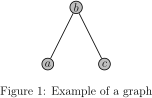

# Exercises

Most topics are covered by this page: <https://en.wikibooks.org/wiki/LaTeX>

Otherwise, googling "latex <topic>" is the way to go (e.g. "latex insert matrix").

A helpful resource for typesetting math, if you don't know the syntax is: <http://www.codecogs.com/latex/eqneditor.php>  
It lets you point and click to insert symbols and generate the code for you.

## Basics 

For each of the basic exercises, create a `.tex` file named `ex_j.tex` for the j'th exercise and as the first line put

```tex
\subsection*{Exercise j}
```

In the file `exercises.tex` add the file with the command `\input`, and build `exercises.pdf` with `pdflatex`.

1. Typeset the following (hint: `\(...\)`):


2. Typeset the following equation using the `equation` environment (i.e. `\begin{equation} ... \end{equation}`):


3. Typeset the following matrix (hint: use the `bmatrix` environment):


4. Typeset the following list (hint: list items can themselves be lists):


5. Typeset the following aligned equations (hint: use the `align*` environment with `&` to align and `\\` as newline):


6. Insert the image `thinking-face.png` located in this folder as a figure (hint: `figure` environment and `\includegraphics{path/to/image.png}`)

7. Typeset the following table (hint: <http://www.tablesgenerator.com/>):


## (Optional) Advanced topics

For the advanced topics, create a new file `advanced.tex`, put a `\section` on the first line, and `\include` it in `exercises.tex`.

1. Create a tikz figure looking like this (you'll need to include the package `tikz` in the document preamble):



Hint: before the `figure` environment, put the line

```tex
\tikzstyle{point} = [thick, circle, draw=black, minimum size=1em, inner sep=1pt, fill=lightgray]
```

Then, you can type `\node[point] (a) at (1,2) {$a$};` to insert a node called `a` at the grid position (1,2) with the label _a_, formatted according to the tikzstyle `point`.
After defining nodes, you can draw lines between nodes like:

```tex
\draw (a) -- (b);
```

where `a` and `b` are the names of nodes.

2. Find out how to define your own `newcommand` (google is your friend) and create the command `reals`, which takes one argument, `n` and outputs 


when you type `\(reals{n}\)`.
