```{r setup, include=FALSE}
knitr::opts_chunk$set(
  echo = FALSE,
  dpi = 150,
  fig.align = "center"
)
```

When you work on a large project such as a semester project, especially if you work in a group with multiple people, you should care about _version control_.

With a version control system (VCS) in place, instead of having to ensure no one is editing the same file at the same time, anyone can edit any file at any time, and the VCS takes care of merging the changes into one common version.
Additionally, you can easily revert changes that turned out to be undesirable by reverting the file to a previous version.

The most popular VCS is **git**, a distributed version control system designed by Linus Thorvalds, the creator of the Linux kernel.
It is a command line tool, but several graphical programs exist to make it easier for you to use.

**GitHub** is an online service for hosting git repositories.
Having a repository on GitHub is an easy way to collaborate with your group, showing progress to your supervisor, and having a remote backup of your files, in case all your computers break down suddenly.


# Step 1: Make a GitHub student account

Free accounts on GitHub can only have public repositories, i.e. everyone can view your files, but university students can get a free account upgrade, allowing for private repositories.

1. Go to <http://github.com> and sign up with your university email
2. Go to <https://education.github.com/discount_requests/new> to start applying for a student discount
3. Tick _Student_ and _Individual account_ and click Next
4. Fill in your details and click Submit request

The request should go through fairly quickly.


# Step 2: Install git and GitHub Desktop

Download git from here: <https://git-scm.com/downloads>.
Make sure you get the 64 bit version if you have a 64 bit OS - the automatic download might get you the 32 bit version.

Download GitHub Desktop from here: <https://desktop.github.com/>.
It's a simple, graphical interface to git that integrates with GitHub.


# Step 3: Create a project repository

For your semester project, one of you creates and hosts a repository and invites the others as collaborators.
Log into GitHub and click the `+` button in the top right corner to create a new repository.

```{r}
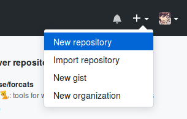
```

Fill in the details.
Make sure you set it to Private and add a TeX .gitignore (more on this later).

```{r}
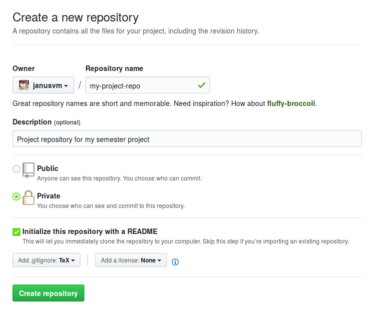
```
Now, go to the Settings tab, click Collaborators, and add all the group members.

```{r}
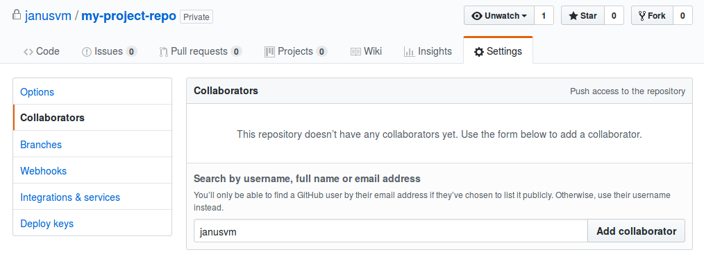
```

# Step 4: Clone the repository

When you have just created the repository, it only exists on GitHub, but you are going to be editing files locally.
_Cloning_ the repository copies all the files (and edit history) to your computer and establishes a link between your local files and the remote server.

1. Open GitHub Desktop and go to File > Clone repository (Ctrl + Shift + O).
2. Select the repository from the GitHub.com tab, or input the link directly 
```{r}
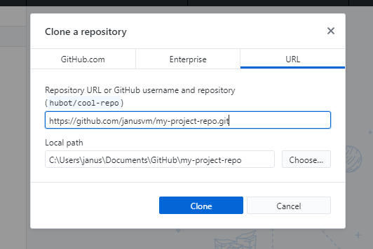
```
3. Choose the folder on your computer where you want the files stored and click Clone


# Step 5: Workflow

Git has a bit of a learning curve, so I will only cover the most basic features which you will need for a typical semester project.

The main git commands you will be using are:

- `commit`
- `push`
- `pull`

When you make changes to files in your project, those changes are not automatically added to the version history by git.
You decide when changes are "ready" to be added to the history by _committing_ them.

In GitHub Desktop, local file changes are listed in the staging area to the left.
You can revert local changes by right-clicking on files and selected Discard changes.
Tick all the files whose changes you want to commit, write a commit message in the bottom left, and click the Commit button.

```{r}
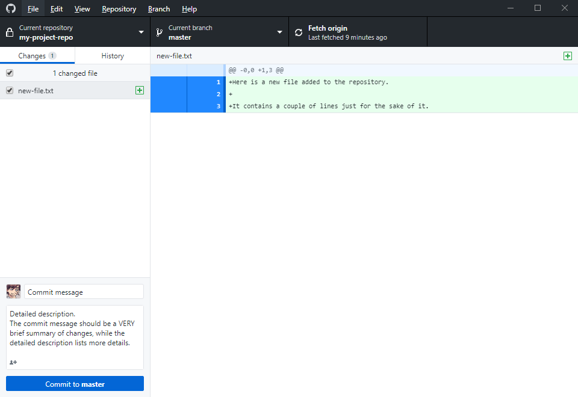
```

This adds a commit to the repository _locally_.
The remote repository on github.com remains unchanged until you _push_ them to the server.
This is reflected by the rightmost button in the toolbar, which will change according to the status of your repository:

```{r}
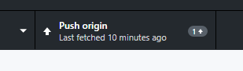
```

The arrow pointing upwards signifies that you are ahead of the remote repository, and the number tells you by how many commits you are ahead.
Clicking the button will push your local commits to the remote.

When your group members commit changes and push them to the remote, you will see the button change to say _Pull origin_ (you may have to refresh the status by clicking _Fetch origin_ first).
Like with pushing commits, a downwards arrow and a number will indicate that you have a number of commits to download.
Click to button to _pull_ the changes into your local repository.

```{r}
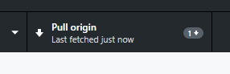
```


## Good practices

When you sit down to work on the project, keep the following in mind:

- Always pull commits before you start making changes yourself
- Always push changes when you are done
- Always either commit or discard all changes, i.e. don't leave uncommitted changes in your local repository
- Always write descriptive commit messages
- Group changes into commits that form a logical unit, i.e. don't just commit _all_ your changes as one big commit


## Conflicts

Scenario: you are working on the file `new-file.txt` from home, following the good practices above.
You commit your changes and get ready to push to the remote, but then you see the button changing to this:

```{r}
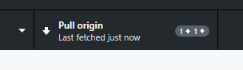
```

This signifies that someone pushed commits to the remote before you.
It prompts you to pull, since you must resolve eventual conflicts before pushing.
After clicking, you are met with a popup saying **Merge conflicts found**.

```{r}
# 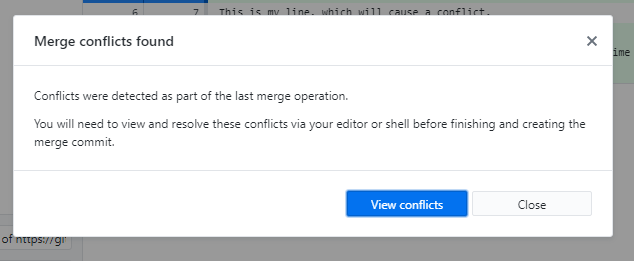
```

Click View conflicts to see the damage:

```{r}
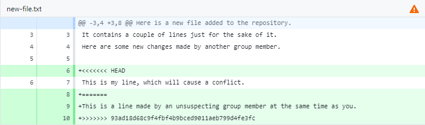
```

Git has inserted some eye-grabbing lines that shows you where the conflicts are:

- The line `<<<<<<< HEAD` shows you where _your_ changes start.
- The line `=======` divides your changes from the incoming changes.
- The line `>>>>>>> 93ad18d...` shows where the incoming changes end (93ad18d... is the id of the commit)

Open the file in a text editor and edit it to reflect which changes should be kept.
That is, decide whose changes should be kept --- yours, your group member's, or both.
When you are done, delete the lines Git created and commit the resolved changes.

```{r}
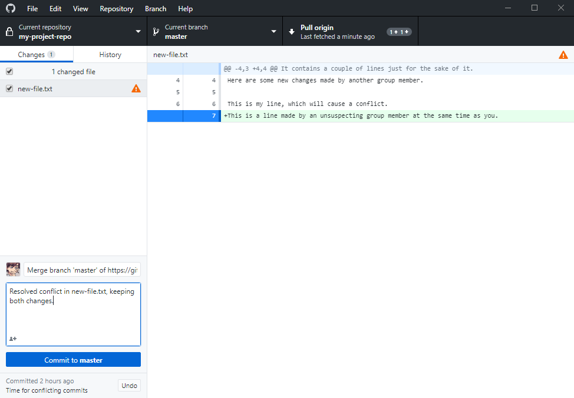
```

Push the changes and you are done, conflict resolved.


## Ignoring files

Not all files should be kept under version control.
For example, when you build a PDF with LaTeX, you will get a bunch of auxiliary files that are only used for rendering the final product.
These files are generated every time, and there is never a need to edit them manually, so keeping them under version control would only make the commit logs more confusing.

Such files are typically listed in the file `.gitignore`.
In this file you can add file _patterns_ that Git should ignore when looking at what has changed.
For example, a line reading 

```
*.aux
```

will make Git ignore all files with the file extension `.aux`.

When you set up a repository on GitHub, you have the option of automatically adding a `.gitignore` corresponding to a language you select.
For a semester project, you will typically do fine with the TeX specific `.gitignore`.

Templates for `.gitignore` are available here: <https://github.com/github/gitignore>


## Advanced topics

These were just the very basic features necessary to get started, but Git is a powerful program with _many_ features.
If you want to learn more about what you can do with Git, check out the following links:

- <https://www.atlassian.com/git/tutorials>
- <https://learngitbranching.js.org/>

Note that not all features are supported by GitHub Desktop, and may require you to use the command line or a different graphical client.
