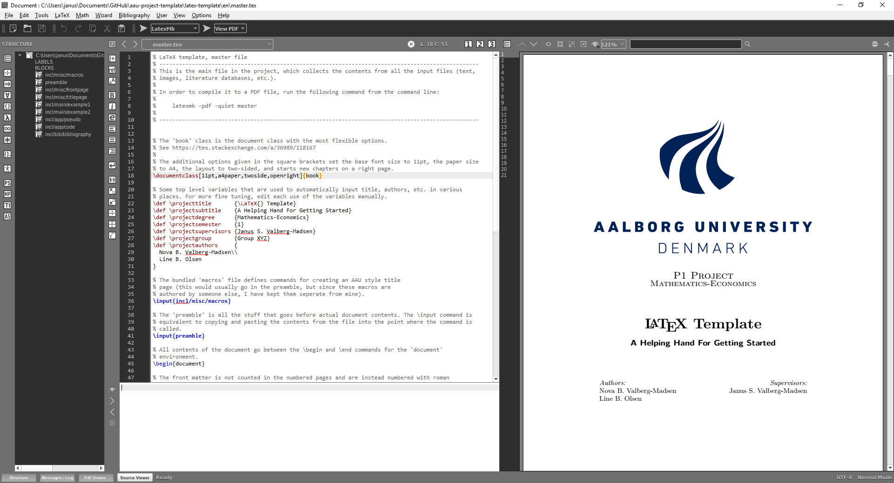
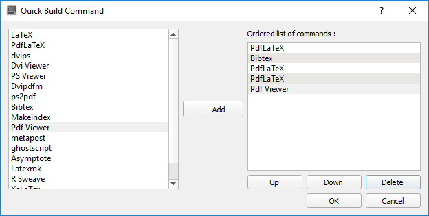

According to its project website,

> _LaTeX, which is pronounced «Lah-tech» or «Lay-tech» (to rhyme with «blech» or «Bertolt Brecht»), is a document preparation system for high-quality typesetting. It is most often used for medium-to-large technical or scientific documents but it can be used for almost any form of publishing._

The keyword here is _system_.
LaTeX is _not_ a word processor like Microsoft Word, it is a set of programs that can render documents based on input `.tex` files containing text and commands.
Input files are plain text files and can be written in any text editor (e.g. Notepad, Sublime Text, Atom, etc.), but specialised programs and plugins exist to make LaTeX authoring easier.

In order to start typesetting documents with LaTeX, you need two things:

1. A LaTeX _distribution_, i.e. an installation of the programs mentioned above
2. A text editor


# Step 1: Installing a LaTeX distribution

First, you need to install a LaTeX distribution.
Depending on your operating system, I recommend the following:

OS | LaTeX distribution | URL
--- | --- | ---
Windows | MikTeX | <https://miktex.org/>
MacOS | MacTeX | <https://www.tug.org/mactex/>
Linux | TeXLive | <https://www.tug.org/texlive/>

This will install command line tools such as `pdflatex`, `bibtex`, etc., and the folder containing the binaries _should_ be added to your system's search path (necessary for the terminal to know where to find the programs).


## (Optional) Installing latexmk

As we will see in Step 3, it takes several runs of `pdflatex` and `bibtex` to properly render a complex document such as a semester project.
The Perl script `latexmk` aims to automate this process by automatically figuring out what needs to be done for you.

Depending on your OS and distribution, the following steps are needed to install it:


### Windows (MikTeX)

Windows does not have Perl installed by default, so you have to install a distribution of this as well.
The easiest and best is Strawberry Perl (<http://strawberryperl.com/>).

Next, if you didn't install the complete version of MikTeX (i.e. with _all_ LaTeX packages preinstalled), you will have to install the `latexmk` package with the package manager:

- Open **MikTeX Console**
- Go to the _Packages_ tab
- Search for `latexmk`
- If the package is not installed, select it and click the `+` button


### MacOS (MacTeX)

Perl should already be installed.

With MacTeX, `latexmk` should already be installed.
If it's not, open "TeX Live Utility", search for it and install it (similarly to MikTeX).
Alternatively, install it from the Terminal:

```console
sudo tlmgr install latexmk
```


### Linux (TeXLive)

Perl should already be installed.

You may have to install `latexmk` via your system's package manager, e.g. for Ubuntu:

```console
sudo apt-get install latexmk
```


# Step 2: Installing a text editor for LaTeX

You can use any text editor for writing `.tex` files, but unless you already have a preference, I recommend starting with an editor specialised for LaTeX such as **TeXMaker**.

Download from here: <http://www.xm1math.net/texmaker/>


# Step 3: Compiling a document

For this step I will show how to compile documents using TeXMaker's features.
The basic interface is shown below.



By default, TeXMaker has a three-panel layout with the document outline, the text editor itself, and the PDF preview, respectively.
Buttons for compiling and viewing the output is located above the editor pane.

The first thing you want to do is to set the _master_ document.
This is the `.tex` file that the program compiles when you click the Run button.
If no master document is set, the program will try to compile the currently open document, which is not what you want when working with large, modularised projects.

1. Make sure the master file is currently open
2. Click Options > Define Current Document As 'Master Document'

The document is compiled by selecting an action in the first dropdown in the tool bar and clicking the Run button next to it.
There are several available actions, but the most important ones to you are:

- **Quick Build** (F1) is a customisable set of actions (default is PDFLaTeX + View PDF)
- **PDFLaTeX** (F6) is the main command for compiling a PDF file
- **BibTeX** (F11) is used for citations
- **LatexMk** automates the process

When you compile a PDF, LaTeX creates several auxiliary files with various info, which are used in subsequent runs.
Due to how these files are generated, if you have references or citations in your document (which you most likely will), you need to run the following commands to render the PDF correctly:

**PDFLaTeX --> BibTeX --> PDFLaTeX --> PDFLaTeX**

TeXMaker lets you define your own build commands, which you can use to automate this.



Alternatively, you can use `latexmk` directly from TeXMaker.
